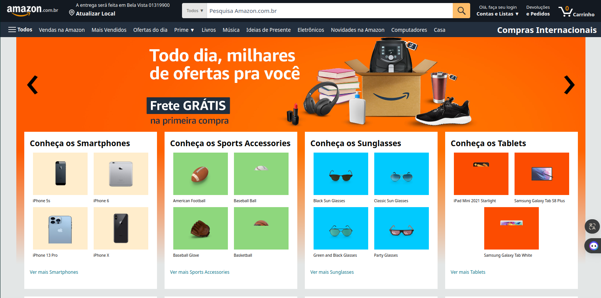

# Amazon Clone

Este projeto visa replicar apenas a página principal da Amazon com todas as suas dinâmicas, alimentado com uma Fake API apenas para demonstração.

## Características por Componente

### Header

- Botões "hover" estilizados escurecem a tela para destacar o objeto principal.
- A barra de pesquisa guarda a informação pesquisada anteriormente num histórico que pode ser reutilizado ou deletado.

### Menu Hambúrguer

- Menu principal com animação lateral de entrada e saída.
- Escurece a tela e trava a rolagem.

### Corpo da Página

- Slider superior infinito (precisa de reparo).
- Cards de produtos e sliders secundários para visualização de produtos da mesma categoria.

### Rodapé

- Simulação do slider de itens baseado nas pesquisas e compras do usuário.
- Footer com informações padrão do site.

## Como Usar

1. Clone este repositório.
2. Instale as dependências usando `npm install`.
3. Inicie o servidor de desenvolvimento com `npm run preview`.

## Contribuindo

Se quiser contribuir com este projeto, siga estes passos:

1. Faça um fork do projeto.
2. Crie uma nova branch com a sua feature (`git checkout -b feature/nova-feature`).
3. Faça commit das suas mudanças (`git commit -m 'Adicionando nova feature'`).
4. Faça push para a branch (`git push origin feature/nova-feature`).
5. Abra um Pull Request.

## Licença

Este projeto está licenciado sob a Licença MIT - veja o arquivo [LICENSE.md](LICENSE.md) para mais detalhes.
